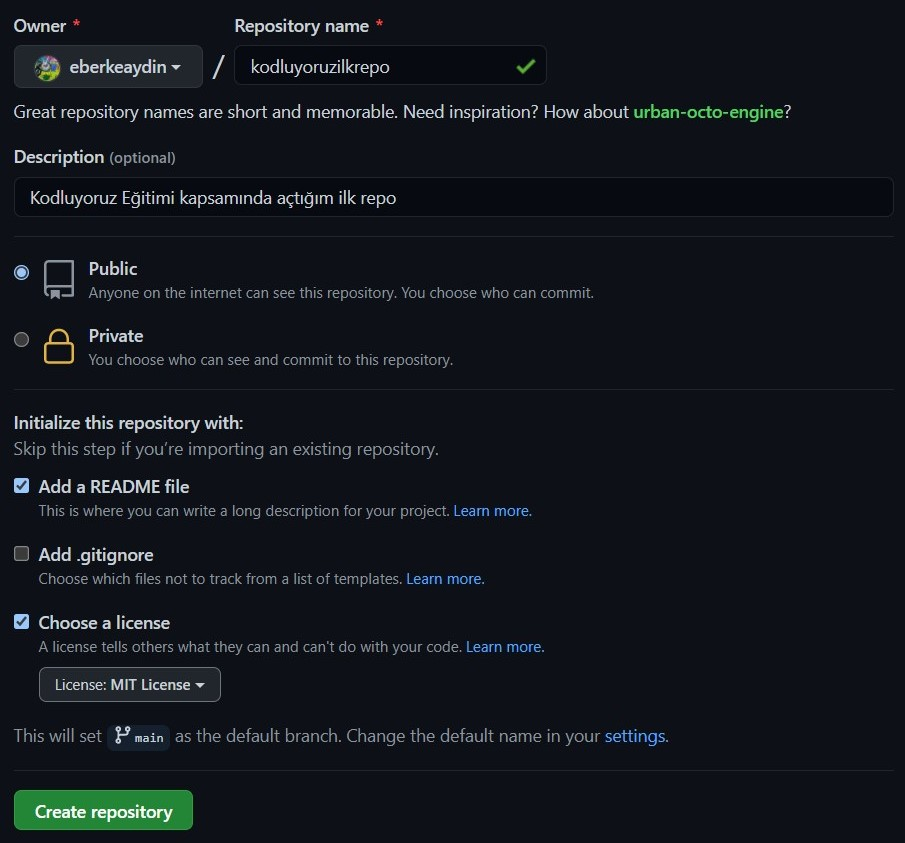

# Kodluyoruz İlk Repo
Bu repo [Kodluyoruz](https://www.kodluyoruz.org/) Front End Eğitiminde oluşturduğumuz ilk repo. İçerisinde bir adet
README dosyası, bir adet de index.html barındırıyor.

## Installation
Öncelikle projeyi clonelayın. (https://github.com/eberkeaydin/kodluyoruzilkrepo) :
git clone (https://github.com/eberkeaydin/kodluyoruzilkrepo)

## Usage
Projeyi cloneladıktan sonra Visual Studio Code ortamında açınız.
Linux için :
cd kodluyoruzilkrepo
code .

## Contributing
Pull requestler kabul edilir. Büyük değişiklikler için, lütfen önce neyi değiştirmek istediğinizi tartışmak için bir konu açınız.

## Liscence 
[MIT](https://choosealicense.com/licenses/mit/)

